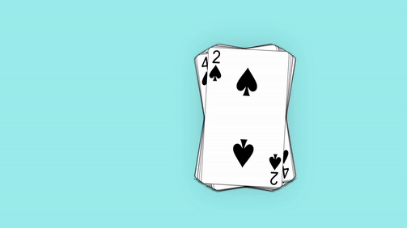

<!-- [](https://badge.fury.io/js/card-flick-react) -->
<!-- [](https://travis-ci.org/jorgejimenezdev/card-flick-react) -->
<!-- [](https://coveralls.io/github/jorgejimenezdev -->

[](https://www.npmjs.com/package/card-flick-react)
[](https://github.com/jorgejimenezQ/card-flick/actions/workflows/test.yml)
[](./LICENSE)

# Card Flick React - a card swiping effect in your React web application.

Card Flick React is a React component that allows you to add a card swiping effect to your web application.

<!-- The gif displaying the card effect -->

## Demo



## Installation

To install Card Flick React, simply run the following command in your terminal:

```bash
npm install card-flick-react
```

or

```bash
yarn add card-flick-react
```

## Usage

To use Card Flick React:

1. Import the CardFlick component from the package.
2. Pass an array of cards to the CardFlick component.
3. Define callback functions to handle the swiping effect.
4. Render the CardFlick component in your React component.

```jsx
import React from 'react'
import CardFlick from 'card-flick-react'

const cards = [
  { id: 1, content: 'Card 1' },
  { id: 2, content: 'Card 2' },
  { id: 3, content: 'Card 3' },
]

function MyComponent() {
  const handleSwipeRight = (cardIndex) => {
    console.log(`Swiped right on cardIndex with ID ${cardIndex}`)
  }

  const handleSwipeLeft = (cardIndex) => {
    console.log(`Swiped left on cardIndex with ID ${cardIndex}`)
  }

  const handleSwipe = (cardIndex) => {
    console.log(`Swiped on cardIndex with ID ${cardIndex}`)
  }

  return (
    <CardFlick
      className="card-flick-container"
      cards={cards}
      onSwipeRight={handleSwipeRight}
      onSwipeLeft={handleSwipeLeft}
      onSwipe={handleSwipe}
    />
  )
}
```

In this example, we define an array of cards and pass it to the CardFlick component. We also define three callback functions: handleSwipeRight, handleSwipeLeft, and handleSwipe, which are called when the user swipes right, left, or either direction on a card, respectively.

The CardFlick component renders the cards and handles the swiping effect. By default, cards are swiped by dragging them with the mouse or touch gestures.

## Don't forget to style your component!

```css
.cardContainer {
  width: 160px;
  height: 270px;
  margin: 100px auto;
  box-shadow: 0px 0px 74px -31px rgba(0, 0, 0, 0.6);
  -webkit-box-shadow: 0px 0px 74px -31px rgba(0, 0, 0, 0.6);
  -moz-box-shadow: 0px 0px 74px -31px rgba(0, 0, 0, 0.6);
}

.card {
  /* background-color: aqua; */
  height: 100%;
}

.card img {
  width: 100%;
  height: 100%;
}
```

## Props

The CardFlick component accepts the following props:

### cards

An array of objects representing the cards to be displayed. Each object should have a unique id property and a content property, which can be any valid React element or string.

```jsx
const cards = [
  { id: 1, content: 'Card 1' },
  { id: 2, content: 'Card 2' },
  { id: 3, content: 'Card 3' },
]

...

<CardFlick cards={cards} />
```

The content property can also be a React element, such as a div or a component.

```jsx
const cards = [
  {
    id: 1,
    content: (
      <div>
        <h1>Card 1</h1>
        <p>Some content</p>
      </div>
    ),
  },
  {
    id: 2,
    content: (
      <div>
        <h1>Card 2</h1>
        <p>Some content</p>
      </div>
    ),
  },
  {
    id: 3,
    content: (
      <div>
        <h1>Card 3</h1>
        <p>Some content</p>
      </div>
    ),
  },
]
```

## onSwipeRight

A callback function called when the user swipes right on a card. The function is passed the card object as an argument.

```jsx
const handleSwipeRight = (card) => {
  console.log(`Swiped right on card with ID ${card.id}`)
}

...

<CardFlick onSwipeRight={handleSwipeRight} />
```

## onSwipeLeft

A callback function called when the user swipes left on a card. The function is passed the card object as an argument.

```jsx
const handleSwipeLeft = (card) => {
  console.log(`Swiped left on card with ID ${card.id}`)
}

...

<CardFlick onSwipeLeft={handleSwipeLeft} />
```

## onSwipe

A callback function called when the user swipes either direction on a card. The function is passed the card object as an argument.

```jsx
const handleSwipe = (card) => {
  console.log(`Swiped on card with ID ${card.id}`)
}

...

<CardFlick onSwipe={handleSwipe} />
```

## Contributing

If you find a bug or want to suggest a new feature, feel free to open an issue on the GitHub repository. Pull requests are also welcome.

## License

Card-Flick is open-source software licensed under the MIT license. See the LICENSE file for more details.

## Author

[](https://jorgejimenezq.github.io.)

<!-- [](https://www.linkedin.com/in/jorgejimenezq/) -->

<!-- [](https://twitter.com/jorgejimenezQ) -->
